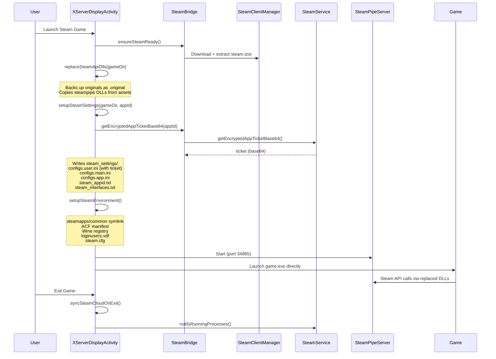

# Steam Integration — Complete Walkthrough

## Architecture Overview

WinNative now matches GameNative's Steam integration approach. Here's how it works end-to-end:

## Files Modified

### [XServerDisplayActivity.java](file:///home/max/Build/Emulator/WinNative/app/src/main/java/com/winlator/cmod/XServerDisplayActivity.java)

| Method | Purpose |
|--------|---------|
| `onBoot()` | Calls `ensureSteamReady()`, `replaceSteamApiDlls()`, `setupSteamSettings()`, `setupSteamEnvironment()` |
| `replaceSteamApiDlls(gameDir)` | Recursively replaces `steam_api.dll`/`steam_api64.dll` with steampipe versions |
| `setupSteamSettings(gameDir, appId)` | Creates `steam_settings/` with auth configs next to each DLL |
| `setupSteamSettingsInDir(...)` | Recursive helper that creates settings in dirs with steam_api DLLs |
| `generateSteamInterfacesFile(dir, dllName)` | Scans backed-up DLL for `SteamXxx###` interface strings |
| `setupSteamEnvironment(appId, gameDir)` | Creates Steam environment (ACF, symlinks, registry, VDF) |
| `exit()` → `syncSteamCloudOnExit()` | Syncs cloud saves on game exit via `SteamService` |
| `getWineStartCommand()` | Launches game exe directly (no ColdClientLoader needed) |

### [SteamBridge.java](file:///home/max/Build/Emulator/WinNative/app/src/main/java/com/winlator/cmod/SteamBridge.java)

| Method | Purpose |
|--------|---------|
| `getEncryptedAppTicketBase64(appId)` | Gets real Steam auth ticket via SteamClientManager |
| `isLoggedIn()` | Checks if user has an active Steam session |

### [SteamClientManager.kt](file:///home/max/Build/Emulator/WinNative/app/src/main/java/com/winlator/cmod/steam/SteamClientManager.kt)

| Method | Purpose |
|--------|---------|
| `getEncryptedAppTicketBase64Blocking(appId)` | Blocking wrapper that calls `SteamService.getEncryptedAppTicketBase64()` via `runBlocking` |
| `isSteamLoggedIn()` | Checks SteamService companion for active login |

## Key Files Created at Runtime

### In game directory (next to `steam_api.dll`):
- `steam_appid.txt` — App ID
- `steam_interfaces.txt` — Interface versions from original DLL
- `steam_api.dll.original` — Backup of original DLL
- `steam_settings/steam_appid.txt`
- `steam_settings/configs.user.ini` — Account name, Steam ID, language, **encrypted app ticket**
- `steam_settings/configs.main.ini` — `disable_lan_only=1` (online mode)
- `steam_settings/configs.app.ini` — `unlock_all=1` (DLC)

### In Wine C:\Program Files (x86)\Steam\:
- `steam.cfg` — Bootstrap inhibit
- `config/loginusers.vdf` — User login data
- `steamapps/common/{game}` → symlink to actual game
- `steamapps/appmanifest_{appId}.acf` — Install manifest

### In Wine Registry (`user.reg`):
- `Software\Valve\Steam\AutoLoginUser`
- `Software\Valve\Steam\SteamExe`
- `Software\Valve\Steam\SteamPath`
- `Software\Valve\Steam\InstallPath`

## Authentication Flow

1. **User logs into Steam** → `PrefManager` stores `user_name`, `steam_user_steam_id_64`, `refresh_token`
2. **Game launch** → `SteamService.getEncryptedAppTicket(appId)` requests ticket from Steam servers
3. **Ticket written** to `configs.user.ini` as `ticket=<base64>`
4. **Steampipe DLLs** read `steam_settings/` and use the ticket for online auth
5. **SteamPipeServer** (port 34865) handles additional Steam API messages

> [!IMPORTANT]
> Online play requires the user to be **logged into Steam** in the app. Without a login, the ticket will be null and games will only work in offline/LAN mode.

## Cloud Sync

- **On exit**: `syncSteamCloudOnExit()` calls `SteamService.notifyRunningProcesses()`
- **SteamService** then runs `SteamAutoCloud.syncUserFiles()` to upload saves
- Only runs if user is logged into Steam
- Runs on background thread to avoid blocking UI

## Credential Sources (PluviaPreferences)

| Key | Type | Purpose |
|-----|------|---------|
| `user_name` | String | Steam account name |
| `steam_user_steam_id_64` | Long | 64-bit Steam ID |
| `steam_user_account_id` | Int | Account ID (32-bit) |
| `refresh_token` | String | Login token for auto-login |
| `access_token` | String | Short-lived access token |
